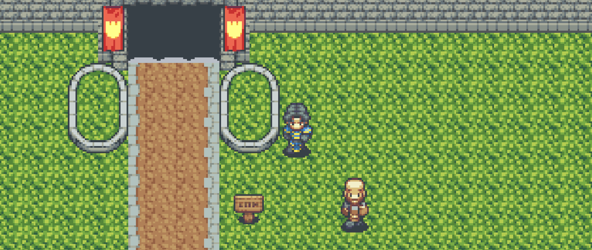

<!-- PROJECT LOGO -->
 

    
  </a>
  <h3 align="center">Trevor Makes A Zelda Game</h3>
  

     
  

<!-- ABOUT THE PROJECT -->
## About The Project

(<a href="#top">back to top</a>)

### Built With

This section should list any major frameworks/libraries used to bootstrap your project. Leave any add-ons/plugins for the acknowledgements section. Here are a few examples.

(<a href="#top">back to top</a>)

